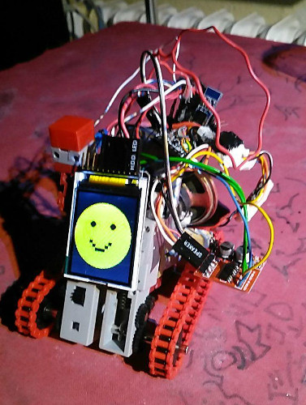
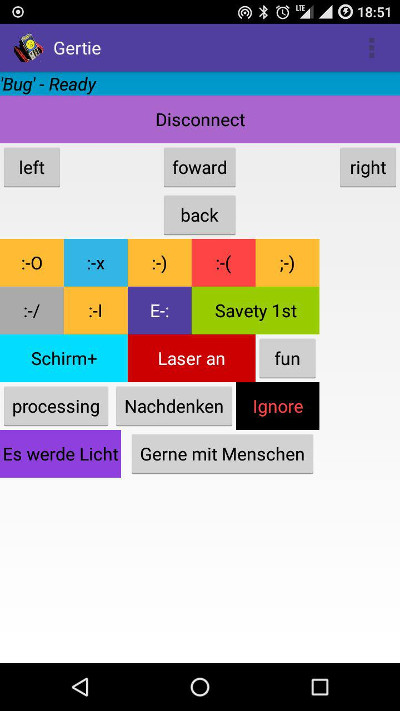

# Gertie

Control an arduino pro mini tank via nRF51822-04AT UART LE Bluetooth 4 module and MX1508 DC motor driver.
Android App Code is very hacky kick ass app based on my UART Smartwatch App. A bit buggy, but ok.

Tank control: forward, backward, left, right, some Buttons to display a Emoji on ST7735 TFT Display.

# This Branch

I add 3.3V and GND, Arduino Pin9,8,7,6 to a SOMO similar sound module WTV020-SD-16P

You can get a signed APK from [here](https://raw.githubusercontent.com/no-go/Gertie/sound/app/app/release/app-release.apk)

## Hardware

## Android App

