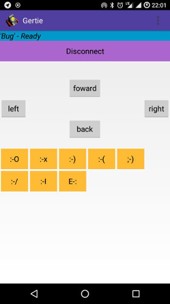

# Gertie

Control an arduino mini tank via nRF51822-04AT UART LE Bluetooth 4 module and MX1508 DC motor driver.
Android App Code is very hacky kick ass app based on my UART Smartwatch App. A big buggy, but ok.

Tank control: forward, backward, left, right, some Buttons to display a Emoji on ST7735 TFT Display.

## Ugly App

You can get a signed APK from [here](https://raw.githubusercontent.com/no-go/Gertie/master/app/app/release/app-release.apk)
